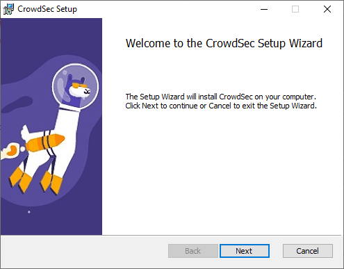

# CrowdSec Setup

 

## Step 1: Download CrowdSec Software

> On the Windows Server or Windows 11 VM, navigate to [CrowdSec](https://www.crowdsec.net/) and sign up for a free account
> 
> Once logged in, follow along with below images to download the CrowdSec file on both Windows Sever and Windows 11 VM
>
> 
>
> 
>
> 

 

## Step 2: Install CrowdSec

> Launch CrowdSec file and follow installation wizard
>
> 
>
> After installation is finished, open Powershell as Administrator and navigate to the CrowdSec folder
>
> Enter command **_.\cscli.exe collections install crowdsecurity/windows-firewall_**
> 
> 
>
> Once the **_crowdsecurity/windows-firewall_** is installed, open the **_acquis.yaml_** file in the CrowdSec config folder
>
> Add the following lines to the end of the .yaml file, then reboot
>
> **_---_**
>
> **_filenames:_**
>
>  **_-	C:\\Windows\\System32\\LogFiles\\Firewall\\pfirewall.log_**
>
> **_labels:_**
>
>  **_type: windows-firewall_**

 

## Step 3: Enroll VMs to CrowdSec Account

> After the reboot, open Powershell as Administrator
>
> Change directory to the CrowdSec folder
>
> Run command **_cscli console enroll -e context (enrollment token from CrowdSec site)_**
>
> Once enrollment is complete, refresh CrowdSec website to see the newly added device
>

 

# _CrowdSec Setup is complete_

 

[Back To Project's Homepage](https://brismit25.github.io/Home-SOC-Lab-Setup/)
