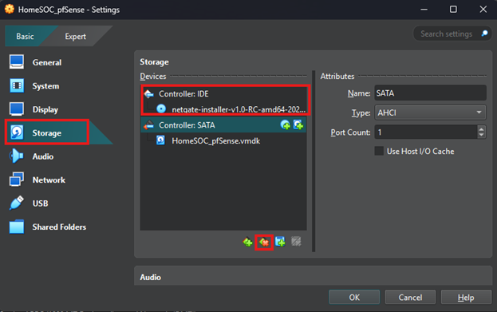

# Step 1: Download pfSense

> Download [pfSense](https://www.pfsense.org/download/) (AMD64 ISO IPMI/Virtual Machine)

# Step 2: Create New VM for pfSense

> Launch Oracle VBM and select "New"
> 
> 
>
> Follow along with below images on completing the VM setup
>
> 
>
> 
>
> 

# Step 3: Network Settings

> Select the pfSense VM's settings and then network
>
> In Network settings configure the following
>
> 
>
> 
>
> 
>
> Make sure to document the MAC Address for each Adapter for later reference

# Step 4: Installing pfSense on VM

> Launch the pfSense VM
>
> 
>
> Accept Copyright and Trademark Notice
>
> 
> 
> Proceed with pfSense installation
>
> 
>
> 
> 
> Verify MAC Addresses
>
> 
> 
> WAN Interface will be left as DHCP
>
> 
> 
> LAN Interface will be the "GREEN" Network Adapter
>
> 
> 
> Assign a Static IP for the LAN Interface
>
> 
> 
> Once install completes reboot the VM
>
> 
>
> 
>
> If VM gets stuck in installation reboot cycle go into the VM's setting and Storage, then remove the Controller: IDE
>
> 

# Step 5: pfSense Network Configuration

> In pfSense main menu select Option 1
>
> 
>
> Verify WAN/LAN is set to the correct MAC Addresses, then assign DMZ Adapter to Optional 1 Interface
>
> 
>
> 
>
> 
>
> Then confirm the choices
>
> 
>
> Next, configure LAN IP and Subnet (leave gateway as none)
>
> 
>
> 
>
> 

# _pfSense Setup is complete_

 

[Back To Project's Homepage](https://brismit25.github.io/Home-SOC-Lab-Setup/)
